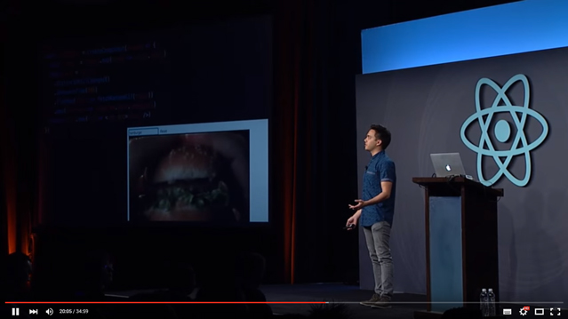

Ultra simple example with MobX inspired by the [great talk](https://youtu.be/ZVYVtUFDf28) of [Andrew Clark](https://github.com/acdlite)

[](https://youtu.be/ZVYVtUFDf28)

For a more sophisticated project see the full TodoMVC implementation: [mobx-react-todomvc](https://github.com/mobxjs/mobx-react-todomvc).

### Run the example

```
npm install
npm start
open http://localhost:3000
```

### Credits

* This template is based on [react-hot-boilerplate](https://github.com/gaearon/react-hot-boilerplate) by Dan Abramov.
* [Mendix](http://github.com/mendix) for providing the opportunity to battle test this approach (we're hiring!).
